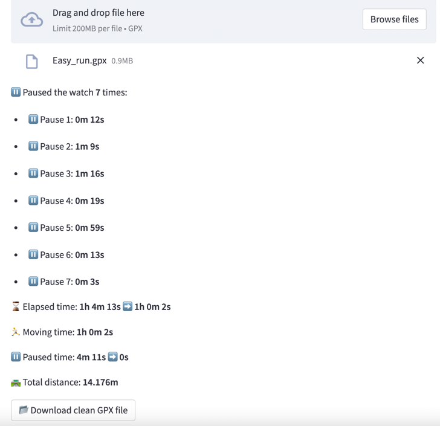

# GPX files cleaner

[](https://share.streamlit.io/davide97l/gpx-cleaner/main)

👉 How frequently does it happen that your running or cycling activities are **interrupted** by a red traffic light,  the need to drink some water, or simply to wait for your partner to reach you? 🤔

👉 Even if you pause your watch during your activity, thus not recording any distance, it will still continue to record your total time which will be then shown as your **elapsed time** in your application such as Strava. However, Strava will count this time instead than your **moving time** to compute your Personal Records and the Segments leaderboard, thus showing a time longer than what your real effort was.

👉 The goal of this application is to **modify** the **gpx file** of your activity to make the elapsed time coincide with your moving time while leaving all the other data unchanged. You will then be able to download your new gpx file and upload it on Strava or on your desired platform.

👉 Feel free to report any bug or suggestion on [Github](https://github.com/davide97l/gpx-cleaner) and leave a ⭐ if you found it useful.

<p align="center">
    
</p>

<h3 align="center">
    Try it out: <br>
    <a href="https://share.streamlit.io/davide97l/running-performance-calculator/main">https://share.streamlit.io/davide97l/gpx-cleaner/main</a>
</h3>

⚠️ Currently are only supported GPX files whose GPS synchronization frequency is exactly 1 second.

## Features

- Automatic pauses detection and clipping on GPX files
- Easy upload and download of your cleaned file
- Clean and user-friendly interface
- The author has over 10 years or running experience including track, road, and trail running

---

## Usage

Clone this repository and set up the environment:
```bash
git clone https://github.com/davide97l/gpx-cleaner
cd gpx-cleaner
pip install -e requirments.txt
```
Run it locally:
```bash
streamlit run streamlit_app.py
```

---

## Support
If you found this project interesting please support me by giving it a :star:, I would really appreciate it :grinning:


 
